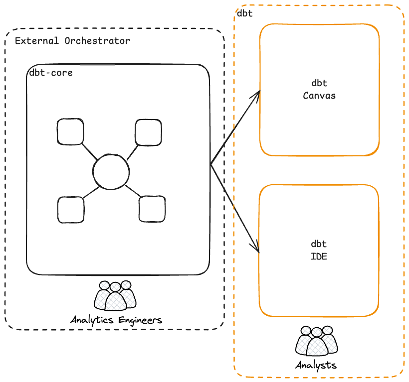

# hybrid-projects

This repo is used for a demo vignette presented at Snowflake's 2025 Summit Conference.

dbt released support for Hybrid architectures with the addition of the core artifacts ingestion feature to dbt in the Spring of 2025. This feature enables organizations operating data mesh architectures (or any architecture that shares data products across projects) to bring dbt-core projects onto the dbt platform by way of their run artifacts ingested post command run. This enables cross-project and dbt Mesh features to work regardless of where you're running dbt, as long as you can communicate with the dbt platform from where dbt-core runs, we'll ingest your run information.

## Example Hybrid Architecture (Donut)

